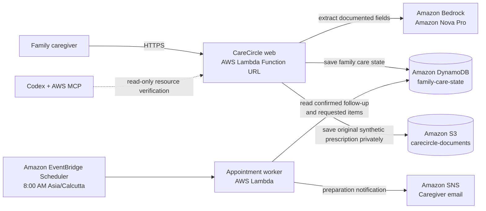
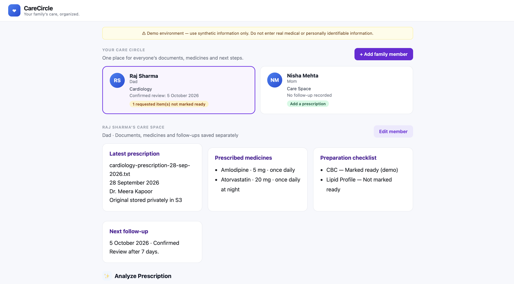
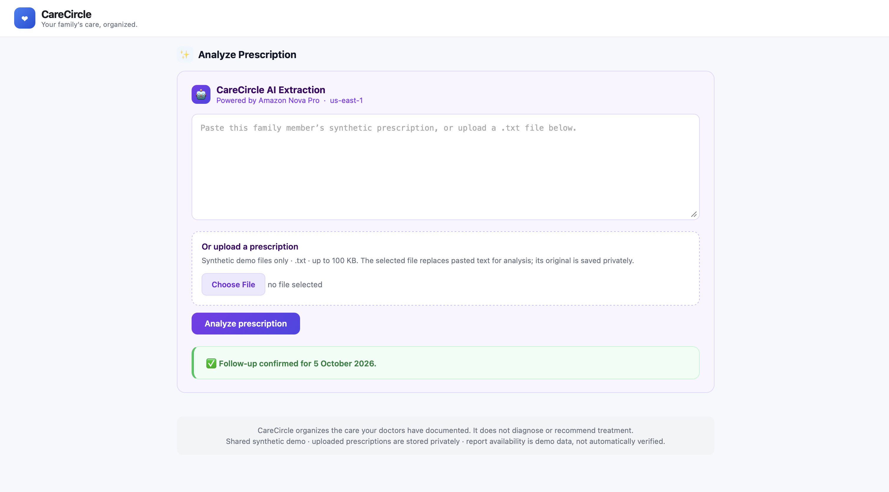
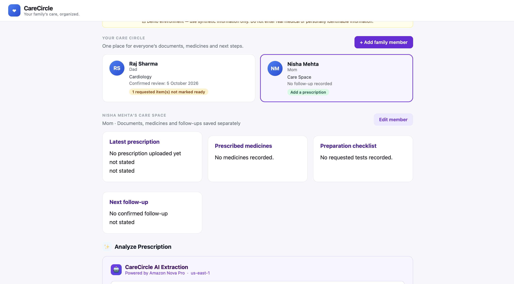

# CareCircle

**Your family's care, organized.**

AWS Zero to Shipped Hackathon submission.

---

## Problem

Families coordinating care across multiple relatives — prescriptions, medicines,
lab tests, reports, and follow-ups — rely on one caregiver to remember what
needs to happen and when. Important documented instructions stay scattered.
Appointments arrive without the right preparation.

---

## Solution

CareCircle turns documented care instructions into organized, timely actions.

- It extracts **only** information explicitly written in the source document.
- It surfaces that information in a structured dashboard grounded in the
  original prescription.
- It proactively checks whether required items are ready before an upcoming
  appointment — and notifies caregivers without being asked.

---

## Live Demo

**[https://s6iax7egqofisycvf2nqyixmxy0dbuhl.lambda-url.us-east-1.on.aws/](https://s6iax7egqofisycvf2nqyixmxy0dbuhl.lambda-url.us-east-1.on.aws/)**

---

## Demo Journey

### Synthetic patient: Raj Sharma (Dad)

**1. A cardiology prescription exists.**
Dr. Meera Kapoor's prescription dated 26 August 2026 prescribes Amlodipine
5 mg and Atorvastatin 20 mg, and explicitly requests two investigations before
the next review: CBC and Lipid Profile.

**2. CareCircle AI extracts the prescription.**
Clicking "Analyze with CareCircle AI" sends the prescription text to Amazon
Nova Pro via Amazon Bedrock. Nova Pro extracts patient, doctor, specialty,
medicines, requested tests, and follow-up — extracting **only** what is written.
Nothing is inferred or added.

**3. The dashboard shows source-grounded information.**
Every displayed item traces back to the Cardiology Prescription dated
26 August 2026. The provenance is shown explicitly on the dashboard.

**4. A cardiology review is approaching.**
The appointment is scheduled for 6 October 2026. With 4 days to go, it enters
the 7-day preparation window.

**5. CareCircle checks what was explicitly requested.**
The appointment worker uses the synthetic demo care state, where CBC and Lipid
Profile were explicitly requested by the prescription.

**6. CBC is ready. Lipid Profile is missing.**
The worker compares the requested items with the synthetic document-availability
state and identifies the gap.

**7. The caregiver receives an SNS notification — without asking.**
CareCircle publishes a structured preparation summary to Amazon SNS.

> **Nobody had to ask CareCircle to prepare for the appointment.**

The proactive worker ran on 2 October 2026, confirmed `notification_sent: true`,
`days_away: 4`, `within_prep_window: true`. This is verified in
`worker-response.json`.

---

## Architecture



**Data flow:**

1. User visits the Lambda Function URL → receives the HTML dashboard.
2. The caregiver selects a family member and submits pasted text or a synthetic
   `.txt` prescription. The web Lambda saves the original privately in S3,
   calls Bedrock Converse API with `amazon.nova-pro-v1:0`, and saves the
   structured care state in DynamoDB.
3. Amazon EventBridge Scheduler runs the appointment check daily at 8:00 AM IST.
   When a confirmed follow-up is within the 7-day preparation window, the worker
   reads DynamoDB, compares requested items with documented availability, and
   publishes one deduplicated preparation summary to Amazon SNS.

The diagram is also available in [assets/architecture.md](assets/architecture.md).

---

## Responsible AI

- All data in this demo is **synthetic** and was created for this hackathon.
- CareCircle performs **extraction only** — it reads what is explicitly written
  in a document and structures it. It does not add, interpret, or infer.
- CareCircle does **not** diagnose conditions.
- CareCircle does **not** recommend treatments or medications.
- CareCircle does **not** recommend changes to prescribed medicines.
- CareCircle does **not** interpret lab results.
- Information that is absent or ambiguous in the source document is returned
  as `null` or flagged for human review — it is never invented.
- CareCircle **coordinates care**; all healthcare decisions belong to qualified
  medical professionals and the family.

---

## Built With Codex and AWS Agent Toolkit

Codex was the coding assistant used to build and ship CareCircle. AWS Agent
Toolkit configured Codex with AWS skills and the AWS MCP Server using the
`family-care-agent` AWS profile.

- Developed the family care dashboard, prescription analysis flow, follow-up
  confirmation, S3 source storage, DynamoDB persistence, and the scheduled
  preparation worker.
- Helped diagnose and test Lambda, DynamoDB, EventBridge Scheduler, SNS, and
  S3 integration issues during development.
- Verified the deployed `family-care-web` Lambda through Codex's native AWS MCP
  connection using a read-only `GetFunctionConfiguration` call in `us-east-1`.

The connection evidence is included at
[`assets/codex-aws-connection-evidence.json`](assets/codex-aws-connection-evidence.json)
and [`assets/codex-fetching-aws-connection.png`](assets/codex-fetching-aws-connection.png).
AWS deployment commands were run by the developer.

---

## AWS Services

| Service | Role |
|---|---|
| **AWS Lambda** (family-care-web) | Serves the HTML dashboard and handles `POST /analyze` Bedrock calls via a Function URL |
| **AWS Lambda Function URL** | Provides the public HTTPS endpoint with no API Gateway required |
| **Amazon Bedrock / Nova Pro** | Extracts structured information from prescription text — `amazon.nova-pro-v1:0`, us-east-1 |
| **AWS Lambda** (family-care-appointment-worker) | Proactive worker: checks preparation window, compares care items, triggers SNS |
| **Amazon EventBridge Scheduler** | Triggers the appointment worker daily at 8:00 AM IST; worker acts only when the appointment is within the 7-day preparation window |
| **Amazon SNS** | Delivers the caregiver preparation notification |

---

## Project Files

```
family-care-agent/
├── app_web.py                  # Lambda web handler — dashboard + Bedrock analysis
├── appointment_worker.py       # Lambda appointment worker — EventBridge + SNS
├── lambda_smoke.py             # Original smoke-test Lambda (unchanged)
├── carecircle-web.zip          # Deployment package for family-care-web
├── appointment-worker.zip      # Deployment package for appointment worker
├── worker-response.json        # Verified production output from the worker
├── app/
│   └── models/care.py          # Domain models: Medicine, MedicalDocument, FamilyMember
├── test_extraction.py          # Strands/Bedrock extraction prototype (reference)
├── test_autonomous.py          # Strands autonomous scheduling prototype (reference)
├── test_ambiguity.py           # Strands ambiguity-handling prototype (reference)
└── test_data/
    ├── raj_prescription.txt    # Synthetic Raj Sharma prescription
    └── ambiguous_prescription.txt
```

## Deployment

```bash
# Web Lambda
zip -r carecircle-web-fixed.zip app_web.py app -x '*/__pycache__/*' '*.pyc'
aws lambda update-function-code \
  --function-name family-care-web \
  --zip-file fileb://carecircle-web-fixed.zip \
  --profile family-care-agent \
  --region us-east-1

# Appointment worker Lambda
zip appointment-worker.zip appointment_worker.py
aws lambda update-function-code \
  --function-name family-care-appointment-worker \
  --zip-file fileb://appointment-worker.zip
```

**Required environment variable for the appointment worker:**

```
SNS_TOPIC_ARN=arn:aws:sns:us-east-1:<account-id>:<topic-name>
```

**Required IAM permissions (Lambda execution role):**

| Lambda | Permission |
|---|---|
| family-care-web | `bedrock:InvokeModel` on `amazon.nova-pro-v1:0` |
| family-care-appointment-worker | `sns:Publish` on the notification topic |

---

## Disclaimer

CareCircle is a hackathon prototype built with synthetic data. It is not
intended for medical diagnosis, treatment decisions, or real patient data. All
prescription and patient information shown is fictional and was created solely
for demonstration purposes.

## Product Screenshots

### Family overview


### Prescription analysis


### Add a family member

