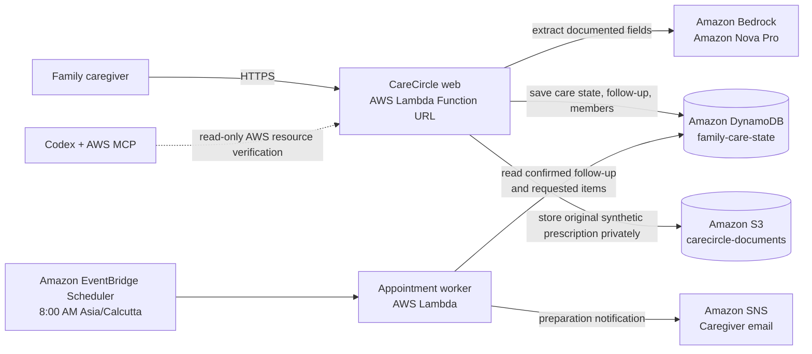

# CareCircle Architecture

## Safety boundary

All demo data is synthetic. CareCircle extracts only documented information,
asks the family to confirm derived follow-up dates, and does not diagnose or
recommend treatment.
